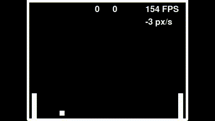

# Single file pong recreation with python and pygame

Paddles are controlled by brute force algo that just follows the ball position.

## Installation

1. Make sure you have Python 3 installed on your machine.
2. Install Pygame library by running the following command in your terminal: `pip install pygame`
3. Clone or download this repository to your local machine.

## Usage

To run the game, navigate to the directory where the file `pong.py` is located and run the following command in your terminal: `python pong.py`

Feel free to experiment with ball speed multiplier and decay multiplier :)

TODO:

- Decoupe game time from rendering